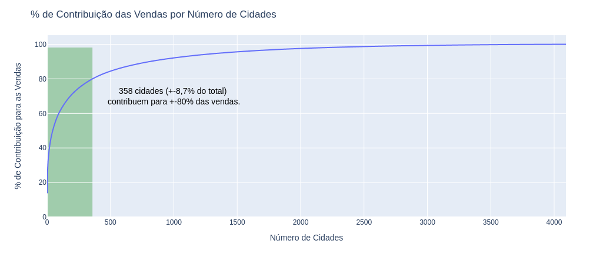
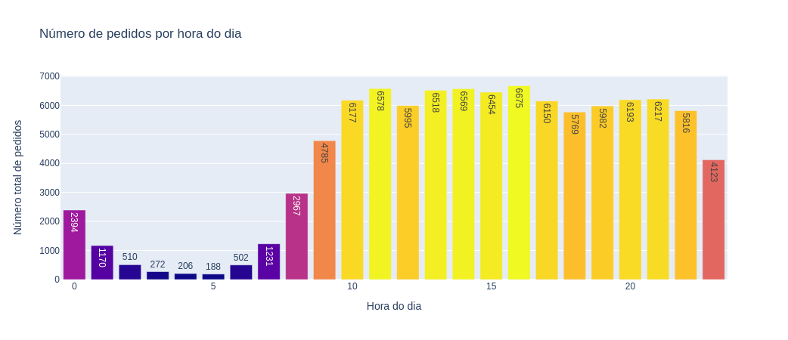
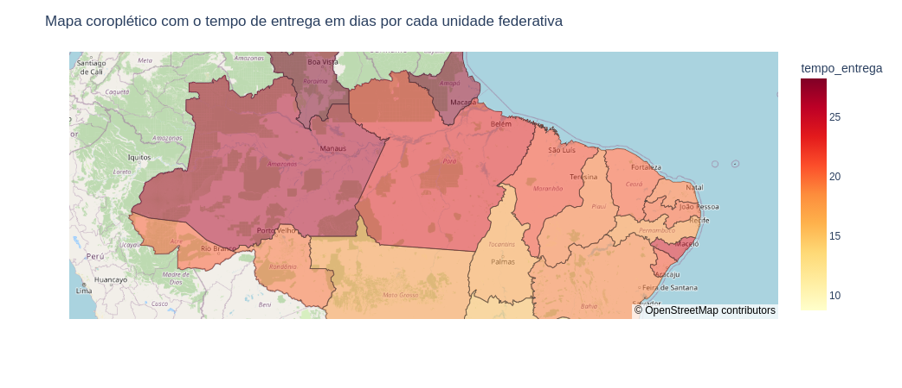

# Olist data-analysis

### O problema de negócio

Olist é uma plataforma de comércio eletrônico brasileira que conecta pequenas empresas a canais de vendas online, permitindo que vendam seus produtos em vários marketplaces do Brasil. A empresa também oferece serviços de logística e gerenciamento de pedidos para seus clientes, e gera muitos dados sobre pedidos, pagamentos, entregas, etc.

O CEO não tem visibilidade completa dos KPIs de crescimento da empresa. Para acompanhar a crescimento do negóco, o CEO gostaria de ver algumas métricas de crescimento e também gostaria de algumas respostas para perguntas de negócio abaixo. Além disso, foi solicitada uma análise de valor dos clientes contidos na base de dados Olist para auxiliar o time de maketing com campanhas precisas.

*A análise do valor do cliente (Customer value) está no diretório customerValue.*

#### Para os pedidos:

- Quantidade de pedidos por dia
- Quantidade de pedidos por hora do dia
- Quantidade de pedidos por estado
- Quantidade de pedidos por cidade
- O método de pagamento afeta o status do pedido?

#### Para os produtos

- Categorias de produtos mais bem avaliadas
- Categorias de produtos com piores avaliações
- Categorias de produtos mais vendidas

#### Para os clientes

- Distribuição das reviews dos clientes
- Percentual de clientes gerando maior parte da receita
- Quais os clientes que mais compram?
- Como a pontuação média das avaliações dos clientes varia ao longo do tempo?

#### Para as entregas

- Existe alguma relação entre o tempo de entrega e as pontuações das avaliações?
- Cidades dos vendedores com menor/maior tempo de entrega
- Estados com maior/menor tempo de entrega
- Como o tempo médio de entrega varia ao longo do tempo?
- Tempo médio de entrega em dias por cada unidade federativa

#### Para as cidades

- Percentual de cidades gerando maior parte da receita

### Top 3 insights

<a href="https://nbviewer.org/github/math3usvalenca/olist-data-analysis/blob/main/Projeto_Ana%CC%81lise_Explorato%CC%81ria_de_Dados_da_loja_Olist.ipynb" target="_blank" >:rocket: Consulte este link para visualizar o notebook de maneira precisa com todos os gráficos :rocket:</a>

Alguns dos insights obtidos:

- Mais de 75% dos clientes deram uma pontuação igual ou maior que 4 ✅
- 12,5% deram uma pontuação de 1 e cerca de 12% deram uma pontuação de 3 ou 2 ✅
- Os pedidos começam a aumentar por volta das 6h da manhã e atingem o pico às 4 da tarde ✅
- São paulo e rio de janeiro geram a maior parte da receita entre as cidades✅
- O tempo médio de entrega é relativamente alto (12,44 dias), com mediana de (10,19 dias) ✅
- O tempo médio de entrega mais alto foram para as cidades de mocumba,itaquaquecetuba e congonhal ✅
- O tempo médio de entrega mais curto foram para as cidades de várzea paulista, hortolandia e ribeirão preto ✅

