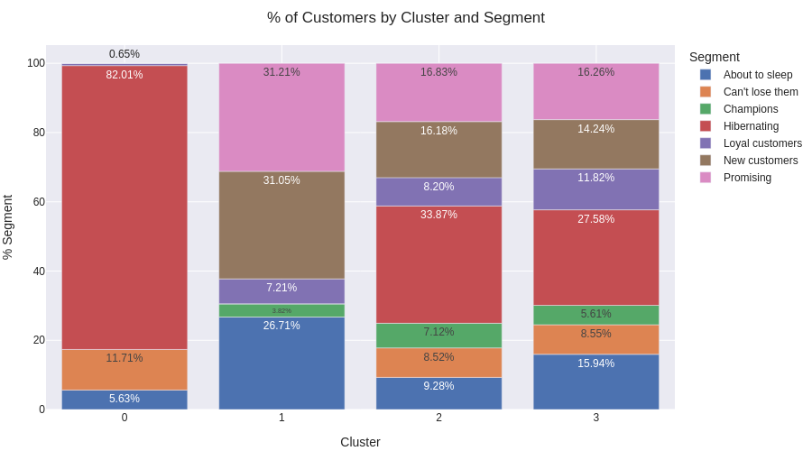
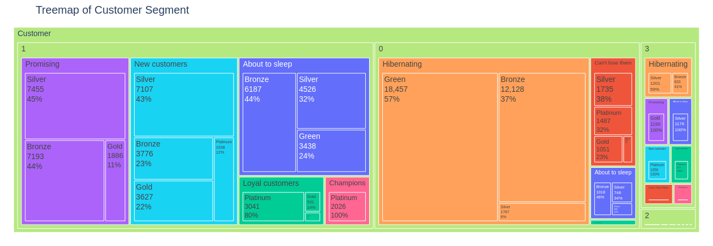

### High Value Customer

Notebook viewer: https://nbviewer.org/github/math3usvalenca/olist-data-analysis/blob/main/customerValue/customerValue.ipynb

Foi utilizado o algoritmo de clusterização K-means e as análises se basearem nas métricas RFM:

- Recency - recência de compra de um cliente (o quão recente)
- Frequency - frequência de compra de um cliente
- Monetary Value - valor do cliente (pode ser o total ou a média de gasto de cada cliente)

#### Interpretações de alguns dos clusters encontrados:

<table style="height: 186px; width: 763px;margin:5px">
<tbody>
<tr>
<td style="width: 176.875px;">Cluster</td>
<td style="width: 176.875px;">RFM Label</td>
<td style="width: 176.875px;">Interpretation</td>
<td style="width: 231.375px;">Actioinable insight</td>
</tr>
<tr>
<td style="width: 176.875px;">0</td>
<td style="width: 176.875px;">82% Hibernating/ 11% Can't lose them/6% About to sleep</td>
<td style="width: 176.875px;">Clientes que n&atilde;o compram h&aacute; muito tempo e t&ecirc;m baixo n&uacute;mero de pedidos. Clientes inativos e/ou prestes a se tornarem inativos.</td>
<td style="width: 231.375px;">

Enfoque em reativar os clientes hibernantes, oferecendo promo&ccedil;&otilde;es ou descontos personalizados para incentivar novas compras.

Acompanhamento especial para os clientes classificados como "Can't lose them" e "About to sleep", oferecendo incentivos adicionais, produtos novos/populares e mantendo contato para evitar a perda para concorr&ecirc;ncia.

</td>
</tr>
</tbody>
</table>

<table style="height: 186px; width: 763px; margin:5px">
<tbody>
<tr>
<td style="width: 176.875px;">Cluster</td>
<td style="width: 176.875px;">RFM Label</td>
<td style="width: 176.875px;">Interpretation</td>
<td style="width: 231.375px;">Actioinable insight</td>
</tr>
<tr>
<td style="width: 176.875px;">1</td>
<td style="width: 176.875px;">31% New customers/31% Promising/27% About to sleep</td>
<td style="width: 176.875px;">Clientes que compraram recentemente, mas n&atilde;o com frequ&ecirc;ncia.&nbsp;Compradores recentes, mas n&atilde;o gastaram muito.&nbsp;Valores de rec&ecirc;ncia e frequ&ecirc;ncia abaixo da m&eacute;dia.</td>
<td style="width: 231.375px;">

Focar em transformar os clientes "New customers" em compradores regulares, oferecendo incentivos para aumentar a frequ&ecirc;ncia de compra.

Para os clientes "Promising", incentivar compras adicionais com ofertas personalizadas,&nbsp;criar reconhecimento da marca e oferecer amostras gr&aacute;tis de produtos.

&nbsp;

</td>
</tr>
</tbody>
</table>

#### Alguns insights dos clusters

